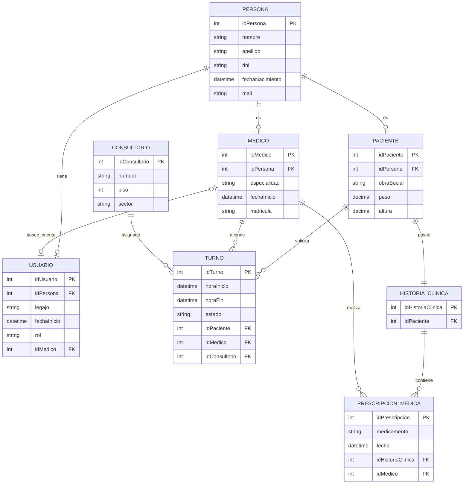

# Diagrama Entidad-Relación - Clínica Enza

El siguiente diagrama representa el modelo de persistencia del sistema de Clínica Enza utilizando SQLite.

```mermaid
erDiagram

    PERSONA {
        int idPersona PK
        string nombre
        string apellido
        string dni
        datetime fechaNacimiento
        string mail
    }

    USUARIO {
        int idUsuario PK
        int idPersona FK
        string legajo
        datetime fechaInicio
        string rol
        int idMedico FK
    }

    PACIENTE {
        int idPaciente PK
        int idPersona FK
        string obraSocial
        decimal peso
        decimal altura
    }

    MEDICO {
        int idMedico PK
        int idPersona FK
        string especialidad
        datetime fechaInicio
        string matricula
    }

    CONSULTORIO {
        int idConsultorio PK
        string numero
        int piso
        string sector
    }

    TURNO {
        int idTurno PK
        datetime horaInicio
        datetime horaFin
        string estado
        int idPaciente FK
        int idMedico FK
        int idConsultorio FK
    }

    HISTORIA_CLINICA {
        int idHistoriaClinica PK
        int idPaciente FK
    }

    PRESCRIPCION_MEDICA {
        int idPrescripcion PK
        string medicamento
        datetime fecha
        int idHistoriaClinica FK
        int idMedico FK
    }

    PERSONA ||--o| USUARIO : tiene
    PERSONA ||--o| PACIENTE : es
    PERSONA ||--o| MEDICO : es

    PACIENTE ||--|| HISTORIA_CLINICA : posee

    HISTORIA_CLINICA ||--o{ PRESCRIPCION_MEDICA : contiene

    MEDICO ||--o{ PRESCRIPCION_MEDICA : realiza

    PACIENTE ||--o{ TURNO : solicita

    MEDICO ||--o{ TURNO : atiende

    CONSULTORIO ||--o{ TURNO : asignado

    MEDICO o|--o| USUARIO : posee_cuenta
```