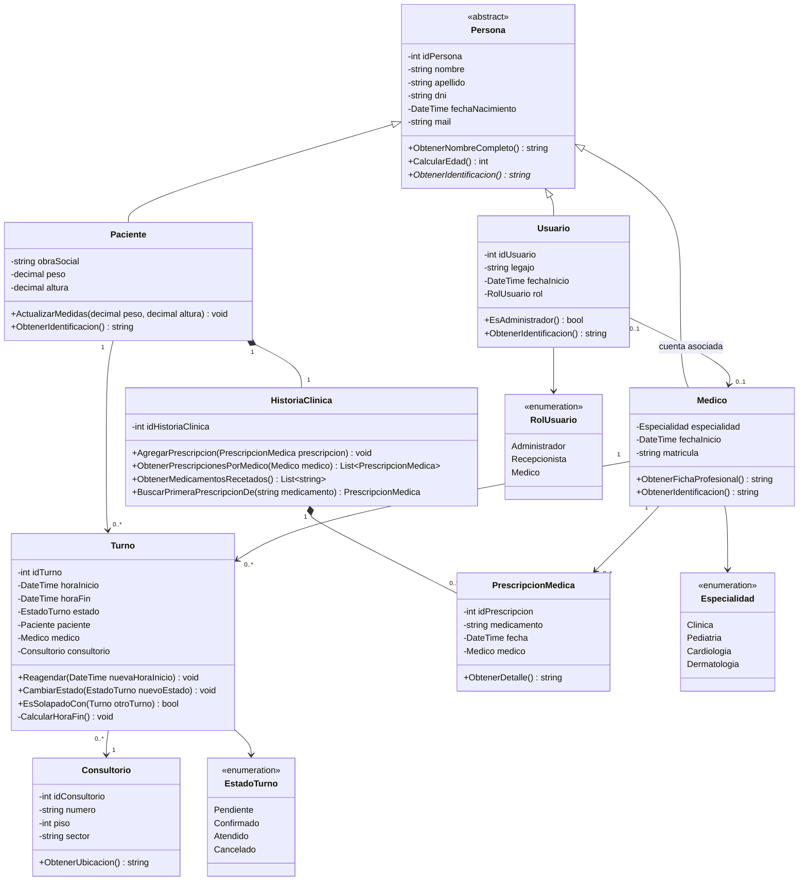

# Diagrama de clases - Clínica Enza

Este diagrama representa las principales clases del sistema de gestión
de turnos e historias clínicas de Clínica Enza.

```mermaid
classDiagram

    class Persona {
        <<abstract>>
        -int idPersona
        -string nombre
        -string apellido
        -string dni
        -DateTime fechaNacimiento
        -string mail
        +ObtenerNombreCompleto() string
        +CalcularEdad() int
        +ObtenerIdentificacion()* string
    }

    class Usuario {
        -int idUsuario
        -string legajo
        -DateTime fechaInicio
        -RolUsuario rol
        +EsAdministrador() bool
        +ObtenerIdentificacion() string
    }

    class Paciente {
        -string obraSocial
        -decimal peso
        -decimal altura
        +ActualizarMedidas(decimal peso, decimal altura) void
        +ObtenerIdentificacion() string
    }

    class Medico {
        -Especialidad especialidad
        -DateTime fechaInicio
        -string matricula
        +ObtenerFichaProfesional() string
        +ObtenerIdentificacion() string
    }

    class Turno {
        -int idTurno
        -DateTime horaInicio
        -DateTime horaFin
        -EstadoTurno estado
        -Paciente paciente
        -Medico medico
        -Consultorio consultorio
        +Reagendar(DateTime nuevaHoraInicio) void
        +CambiarEstado(EstadoTurno nuevoEstado) void
        +EsSolapadoCon(Turno otroTurno) bool
        -CalcularHoraFin() void
    }

    class HistoriaClinica {
        -int idHistoriaClinica
        +AgregarPrescripcion(PrescripcionMedica prescripcion) void
        +ObtenerPrescripcionesPorMedico(Medico medico) List~PrescripcionMedica~
        +ObtenerMedicamentosRecetados() List~string~
        +BuscarPrimeraPrescripcionDe(string medicamento) PrescripcionMedica
    }

    class PrescripcionMedica {
        -int idPrescripcion
        -string medicamento
        -DateTime fecha
        -Medico medico
        +ObtenerDetalle() string
    }

    class Consultorio {
        -int idConsultorio
        -string numero
        -int piso
        -string sector
        +ObtenerUbicacion() string
    }

    class EstadoTurno {
        <<enumeration>>
        Pendiente
        Confirmado
        Atendido
        Cancelado
    }

    class RolUsuario {
        <<enumeration>>
        Administrador
        Recepcionista
        Medico
    }

    class Especialidad {
        <<enumeration>>
        Clinica
        Pediatria
        Cardiologia
        Dermatologia
    }

    Persona <|-- Usuario
    Persona <|-- Paciente
    Persona <|-- Medico

    Paciente "1" *-- "1" HistoriaClinica
    HistoriaClinica "1" *-- "0..*" PrescripcionMedica
    Medico "1" --> "0..*" PrescripcionMedica

    Paciente "1" --> "0..*" Turno
    Medico "1" --> "0..*" Turno
    Turno "0..*" --> "1" Consultorio

    Usuario "0..1" --> "0..1" Medico : cuenta asociada

    Turno --> EstadoTurno
    Usuario --> RolUsuario
    Medico --> Especialidad
```