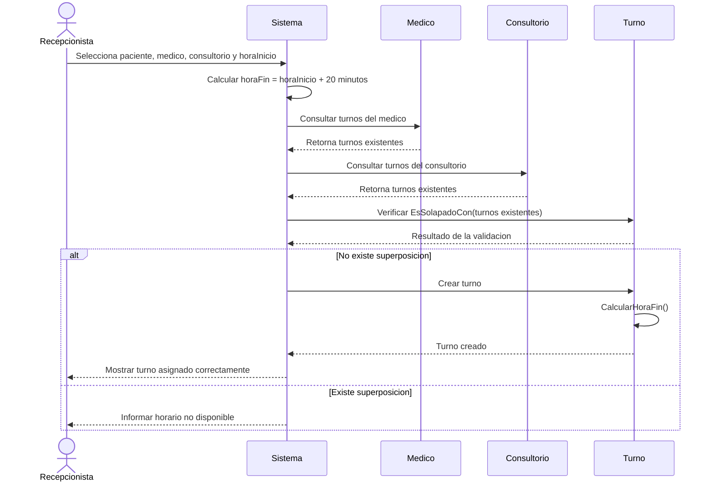

# Diagrama de secuencia - Asignación de turno

El siguiente diagrama representa el proceso de asignación de un turno en Clínica Enza.
El sistema verifica que el médico y el consultorio no tengan un turno superpuesto antes de registrar el nuevo turno. Los turnos tienen una duración fija de 20 minutos.

