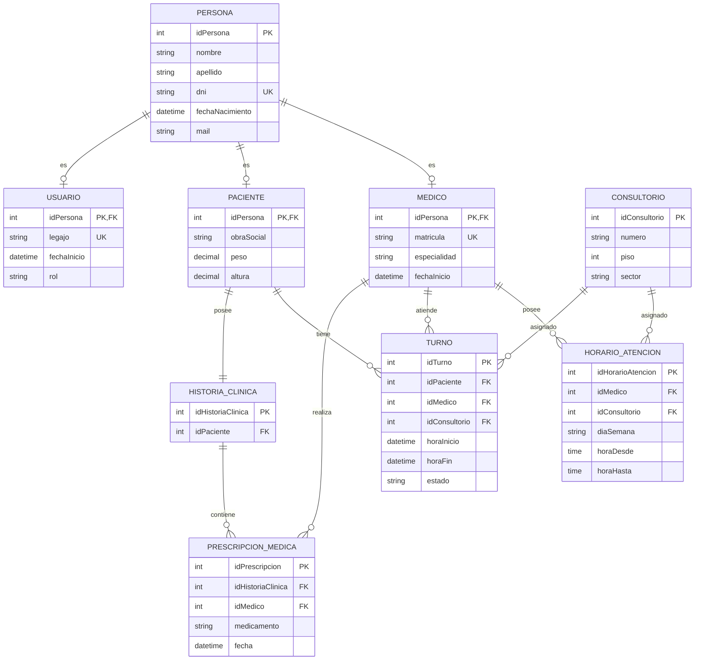

# Diagrama Entidad-Relación - Clínica Enza

El siguiente diagrama representa el modelo de persistencia del sistema de Clínica Enza utilizando SQLite.

## Enumeraciones persistidas

Algunas propiedades del modelo de clases se representan mediante enumeraciones en C#. En SQLite se almacenan como valores simples, pero solamente pueden contener los valores definidos por el dominio.

### Estado del turno

El campo `TURNO.estado` representa el enum `EstadoTurno`.

Valores permitidos:

* `Pendiente`
* `Realizado`
* `Cancelado`

### Rol del usuario

El campo `USUARIO.rol` representa el enum `RolUsuario`.

Valores permitidos:

* `Administrador`
* `Recepcionista`
* `Medico`

### Especialidad del médico

El campo `MEDICO.especialidad` representa el enum `Especialidad`.

Valores permitidos:

* `Clinica`
* `Pediatria`
* `Cardiologia`
* `Dermatologia`

## Restricciones del modelo

* `PERSONA.dni` debe ser único.
* `USUARIO.legajo` debe ser único.
* `MEDICO.matricula` debe ser única.
* Todo turno debe estar asociado a un paciente, un médico y un consultorio existentes.
* Todo horario de atención debe estar asociado a un médico y un consultorio existentes.
* `HORARIO_ATENCION.horaDesde` debe ser anterior a `horaHasta`.
* Los horarios de atención de un mismo médico no pueden superponerse para el mismo día de la semana.
* Un consultorio no puede estar asignado a dos médicos en franjas horarias superpuestas del mismo día.
* Todo turno tiene una duración de 20 minutos.
* Un turno debe encontrarse dentro de un `HorarioAtencion` correspondiente al médico para ese día y horario.
* El consultorio almacenado en `TURNO.idConsultorio` debe coincidir con el consultorio definido por el `HorarioAtencion` utilizado al momento de asignar el turno.
* Un médico no puede tener dos turnos superpuestos.
* `TURNO.estado` solamente puede contener valores definidos por `EstadoTurno`.
* La historia clínica pertenece a un único paciente.
* Una prescripción médica pertenece a una historia clínica y debe estar asociada al médico que la realizó.

Las restricciones de superposición de horarios, disponibilidad y correspondencia entre el turno y el horario de atención se implementan como reglas de negocio en la aplicación y se verifican mediante pruebas.
