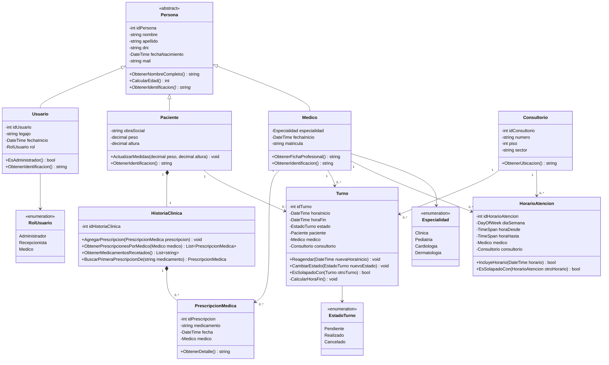

# Diagrama de clases - Clínica Enza

Este diagrama representa las principales clases del sistema de gestión de turnos e historias clínicas de Clínica Enza.

## Enumeraciones

### EstadoTurno

Representa el estado actual de un turno:

* `Pendiente`: el turno fue agendado y todavía no fue atendido.
* `Realizado`: el paciente fue atendido.
* `Cancelado`: el turno fue cancelado.

### RolUsuario

Define el rol de un usuario dentro del sistema:

* `Administrador`
* `Recepcionista`
* `Medico`

### Especialidad

Define la especialidad de un médico:

* `Clinica`
* `Pediatria`
* `Cardiologia`
* `Dermatologia`

## Consideraciones del modelo

Los turnos tienen una duración fija de 20 minutos. Al establecer `horaInicio`, el sistema calcula automáticamente `horaFin`.

`HorarioAtencion` representa la configuración semanal de atención de un médico. Cada horario establece el día de la semana, la franja horaria y el consultorio asignado.

Al crear un turno, el consultorio no es seleccionado manualmente por recepción. El sistema obtiene el consultorio correspondiente a partir del `HorarioAtencion` del médico y lo almacena también en el `Turno`.

Esto permite conservar el consultorio asignado al turno incluso si posteriormente se modifica la configuración semanal del médico.
