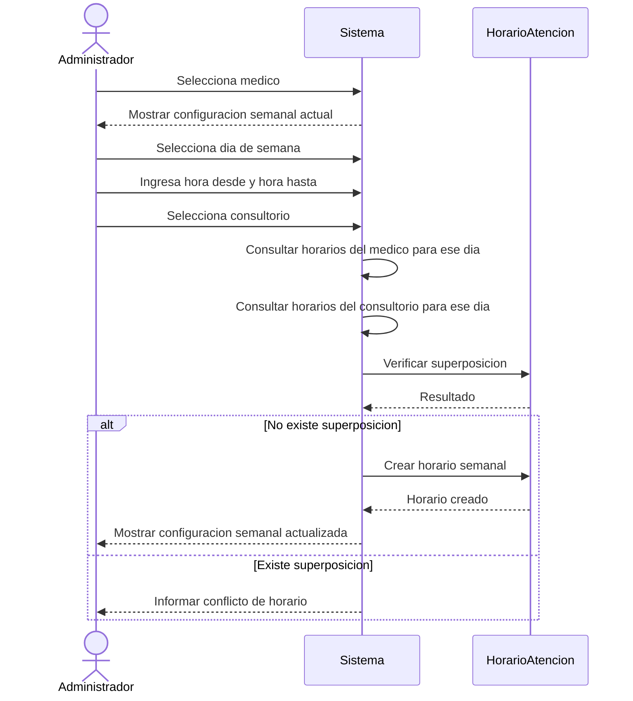

# Diagrama de secuencia - Configuración de horario de atención

El siguiente diagrama representa el proceso de configurar horarios de atención de un mdico en Clínica Enza.
Configurar la agenda del médico: un administrador/recepcionista define cuándo y dónde atiende.

